# Neural style in Tensorflow
## A Tensorflow implementation of the following papers:
###### Feed forward
- ["Perceptual losses for real-time style transfer and super-resolution"](https://arxiv.org/abs/1603.08155)
- ["A Learned Representation For Artistic Style"](https://arxiv.org/abs/1610.07629)
- ["Exploring the Neural Algorithm of Artistic Style"](https://arxiv.org/abs/1602.07188)
- ["Feed-forward neural doodle" blog](http://dmitryulyanov.github.io/feed-forward-neural-doodle/)
- ["Semantic Style Transfer and Turning Two-Bit Doodles into Fine Artworks"](https://arxiv.org/abs/1603.01768)
- ["Texture Networks - Feed-forward Synthesis of Textures and Stylized Images"](https://arxiv.org/abs/1603.03417)

###### Back propagation
- ["A Neural Algorithm of Artistic Style"](https://arxiv.org/abs/1508.06576)
- ["Combining Markov Random Fields and Convolutional Neural Networks for Image Synthesis"](arxiv.org/abs/1601.04589)
- ["Instance Normalization - The Missing Ingredient for Fast Stylization"](https://arxiv.org/abs/1607.08022)
- ["Semantic Style Transfer and Turning Two-Bit Doodles into Fine Artworks"](https://arxiv.org/abs/1603.01768)

This repository is an effort to learn CNN and neural style. As a result, some parts of the code could be poorly named, not commented, or even buggy. It's also my first attempt to submit a project unrelated to any course work on Github. So please bear with me (and my code).

Note that some of the code and images was taken and adapted from code on other neural style related git repo online. I did my best to cite every source I've used, but in case I missed anything or if you're one of the authors and would not like your code to be used in this repo, please let me know.

## Back propagation examples
###### Style Transfer

This is the output of the classic neural style algorithm described in ["A Neural Algorithm of Artistic Style"](https://arxiv.org/abs/1508.06576). Here it takes one content image and one style image and merge the two so that the outcome describe the same scene but with a different artistic "style".

###### Texture Synthesis

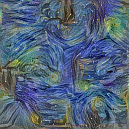

This used essentially the same algorithm in ["A Neural Algorithm of Artistic Style"](https://arxiv.org/abs/1508.06576) but without a content image. As a result, the output showed the texture features of the style image.

###### Multiple style transfer

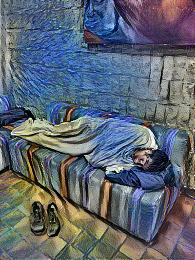
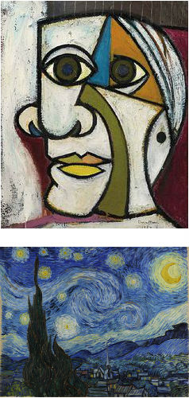

This output is made from weighing Van Gogh's "starry sky" style by 70% and Picasso's "mind, spirit and emotion" by 30%.

###### Using Markov Random Fields

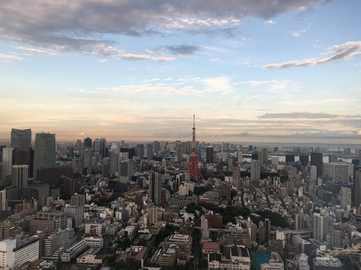

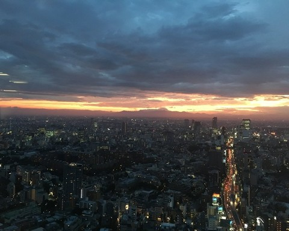

This one is achieved by using the MRF loss mentioned in [this paper](arxiv.org/abs/1601.04589) on two images with similar content but different "style". The result is the original day view of Tokyo turned into a night view.

###### MRF with semantic masks

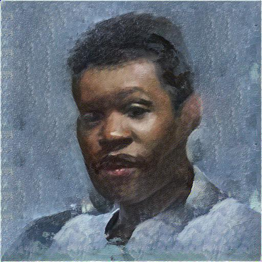

In [the same paper](arxiv.org/abs/1601.04589), the authors also take use of semantically labeled image for style transfer and they got some interesting result, which is repeated here.

###### Style weight mask

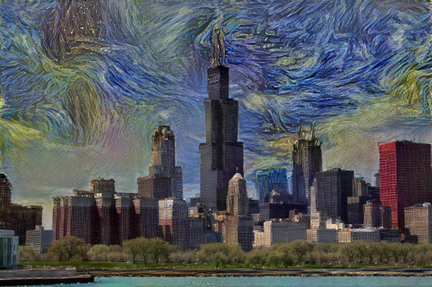

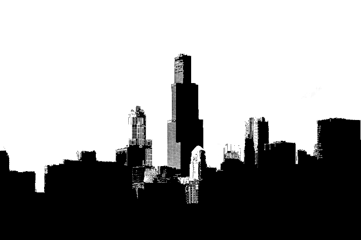

This one is a simple improvement I made to the neural style. When I was using the program, I found that sometimes the program stylize one part of image a little bit too much than what I want but some other parts a little bit less. With the help of what I call 'style weight mask' (in black and white), one can control the degree of stylization for every single pixel.

## Feed forward examples
###### Multi style feed forward network

Original image:

ModelName | Style | Samples
---       | ---   | ---
starry sky |  | 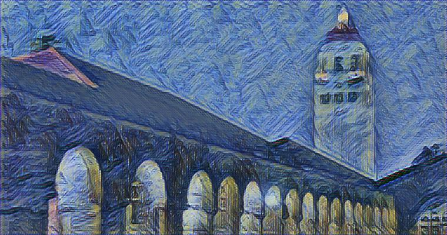
mind, spirit and emotion |  | 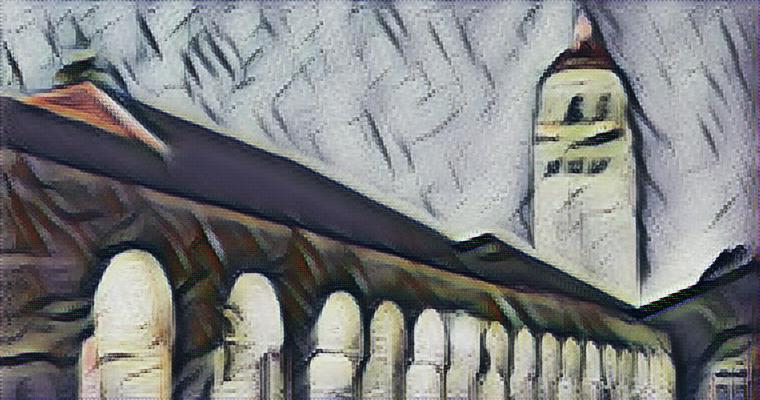
composition_v |  | 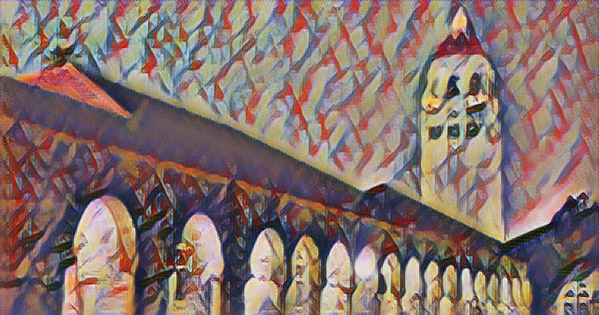
feathers |  | 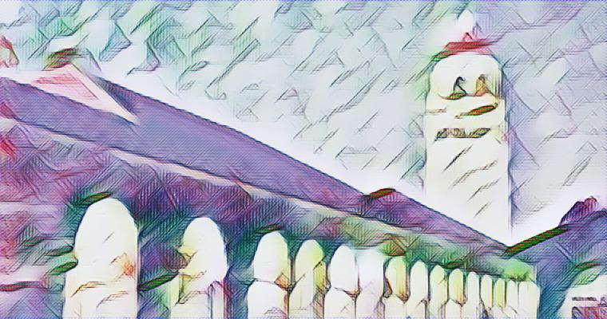
la_muse |  | 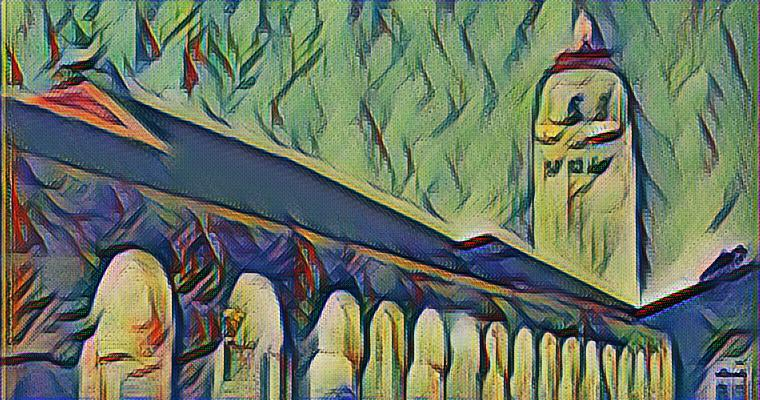
mosaic |  | 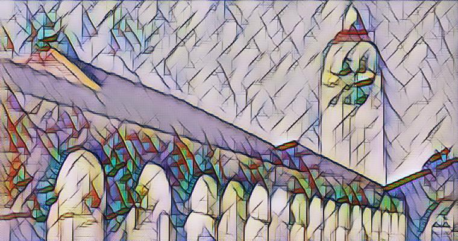
the scream |  | 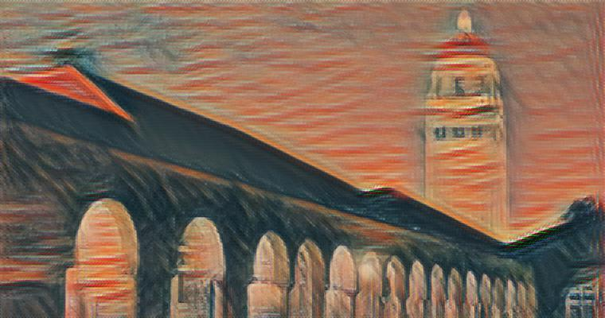
udnie |  | 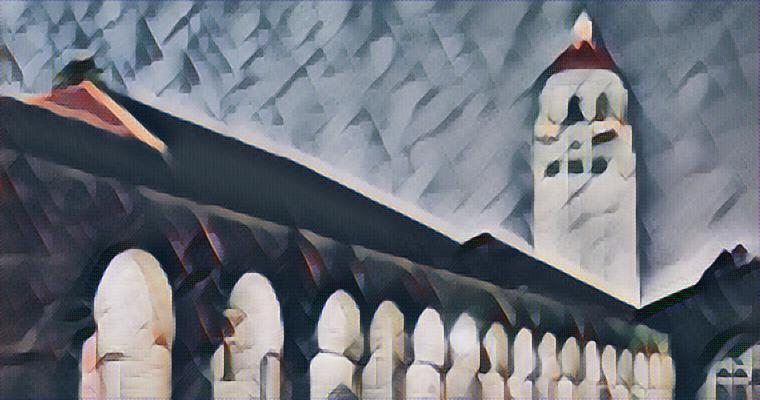
wave |  | 

These are just some examples. With more training time, the results can be better. (Some style images are taken from [here](https://github.com/junrushao1994/fast-neural-style.tf))

###### Neural doodle

TODO: IMAGE MISSING

I basically reimplemented the feed-forward version of [the neural doodle](https://dmitryulyanov.github.io/feed-forward-neural-doodle/), which allows anyone to paint like a real artist within minutes.

## Future plans
* I have yet to implement the style transfer without changing the color of the content image.
* It would be fun if I can improve the neural doodle so that it can draw more semantically complicated things. I've only tried it on paintings on natural scenery.

## Requirements
* Tensorflow
* Anaconda Python 2.7
* typing
* Opencv

## Other information
* Using cpu is ok but it's slow. It's better to use a GPU to train models.
* If you find OOM errors, just decrease the batch size and/or input/output size.
* More examples can be found in [stylize_examples](stylize_examples.py) and [feed_forward_neural_style_examples](feed_forward_neural_style_examples.py)
